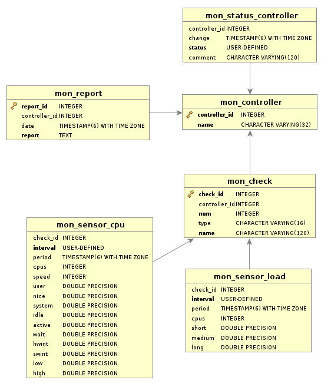

Package: alinex-monitor
=================================================

[](https://travis-ci.org/alinex/node-monitor)
[](https://coveralls.io/r/alinex/node-monitor?branch=master)
[](https://gemnasium.com/alinex/node-monitor)

This application will make server management easy and fast. It will check the
whole IT landscape from the host to the application. While most monitoring
tools has it's focus on the server here the focus lies more on the application
side.

- remote daemon-less analysis
- lots of sensors
- alerting and reporting
- data store for time analysis

The monitor will analyze your whole environment in deep by connecting to the different
systems in parallel and check them deeply. If a problem occurs an additional analysis
step may be made to get more information. The result values will be stored in the
storage database and a detailed report will be created. Based on additional action
rules the report may be send by email or a web request is made. Out of the stored
values time reports may be created.

> It is one of the modules of the [Alinex Universe](http://alinex.github.io/code.html)
> following the code standards defined in the [General Docs](http://alinex.github.io/node-alinex).


Install
-------------------------------------------------

[
 
](https://www.npmjs.com/package/alinex-monitor)

Install the package globally using npm on a central server. From there all your
machines may be checked:

``` sh
sudo npm install -g alinex-monitor --production
```

After global installation you may directly call `monitor` from anywhere.

``` sh
monitor --help
```

Because this application works agentless, you don't have to do something special
on your clients but often some simple changes can make the reports more powerful.
If so you will get a hint in the report.

Always have a look at the latest [changes](Changelog.md).


Usage
-------------------------------------------------
After the monitor and it's controllers are fully configured it may be run by only calling:

    > monitor

This will start the monitor on the command line and check all controllers. For each
controller a line is printed with it's status.
If a controller got a problem it will give a detailed report on the console.

Alternatively you may give a controller name or pattern to select the controllers
to run:

    > monitor my-develop     # run only this controller
    > monitor my-*           # run all controller with the given name prefix

To run the controller continuously use the `daemon` option and start it in the
background.

    > monitor -b > /var/log/monitor.log 2>&1 &

The remaining options are used for informal use like:

- `list` - get a list of all configured controllers
- `tree` - show the list as tree (controller needs controller)
- `reverse` - show a reverse tree (controller is needed by controller)

### Status

The monitor uses the following status:

__running__ if the sensor is already analyzing, you have to wait

__disabled__ if this controller is currently not checked - this will be used
like ok for further processing

__ok__ if everything is perfect, there nothing have to be done - exit code 0

__warn__ if the sensor reached the warning level, know you have to keep an eye on
it - exit code 1

__fail__ if the sensor failed and there is a problem - exit code 2

### Setup

To use the controller you have to setup the whole process using some configuration
files. And maybe a storage database will be used.


Configuration
-------------------------------------------------
This will describe the base setup. Also needed is the controller configuration which
is described in the next section.
Most parts of the configuration is the base setup which is used from within the
controller and sensors.

### Contacts

The contacts are referenced from the controllers and are defined here in a central
file under `/monitor/contacts`. Entries with array are groups and objects are
address entries. Within the controller both may be used.

``` yaml
# Contacts for Monitoring
# =================================================
# This file holds a list of contacts to be used from within the rules and
# specific controllers.

# Groups
# -------------------------------------------------
operations: [aschi]

# Staff
# -------------------------------------------------
aschi:
  name: Alexander Schilling
  position: Developer
  company: Alinex Project
  email: info@alinex.de
  phone: 07129/922545
```
Multiple phone numbers as array are possible.

The contact `monitor` is already defined and used as from address in emails. You
may overwrite it by defining it yourself.

### Email Templates

This templates are used for sending emails out. A `default` template is already
defined and only needs the 'to' address. But you may define more templates under
`/monitor/email`:

``` yaml
# Email Report Configuration
# =================================================

# Default (extended)
# -------------------------------------------------

default:
  # already defined, so only set the 'To' address here.
  to: operations

# Own Templates
# -------------------------------------------------

fail:
  subject: >
    Failed {{alias}}
  body: >
    {{name}}\n
    ==========================================================================\n
    {{description}}\n
    \n
    This test failed at {{date}}!\n
    \n
    {{hint}}\n

warn:
  subject: >
    Warning for {{alias}}
  body: >
    {{name}}\n
    ==========================================================================\n
    {{description}}\n
    \n
    This test failed at {{date}}!\n
    \n
    {{hint}}\n

ok:
  subject: >
    OK for {{alias}}
  body: >
    {{name}}\n
    ==========================================================================\n
    {{description}}\n
    \n
    This test failed at {{date}}!\n
    \n
    {{hint}}\n
```

### Rules

The rules specify what to do in specific situations under `/monitor/rule`:

``` yaml
# Rule Definition
# =================================================

# ### Set templates for default rules
fail:
  email:
    base: fail
warn:
  email:
    base: warn
ok:
  email:
    base: ok

# ### specific check
specific:
  # Only work on specific status.
  status: fail
  # Number of minimum attempts before informing.
  attempt: 3
  # Time (in seconds) to wait before informing.
  latency: 60
  # Only inform if dependent jobs not failed. This prevents of hundred of
  # messages if a central system failed.
  dependskip: true
  # Type of actor to run with it's configuration
  email:
    base: fail # template to use defined under monitor/email
    to: aschi # but send to myself
  # Timeout (in seconds) without status change before informing again.
  redo: 3h
```

### Storage

If you want to store the measurement values, you need the following setup under
`/monitor/storage`:

``` yaml
# Storage settings
# =================================================
# There to store the results of the monitoring.

database: monitor
prefix: mon_
```

The referenced database have to be a __postgresql__ database here and the data
structure will be build on startup automatically. The concrete connection
settings are defined in the `/database` configuration, see below.

### Exec and Database

Also you need the setup under `/exec` and `/database` like described in
[Exec](http://alinex.github.io/node-exec) and [Database](http://alinex.github.io/node-database).
This is used in the different sensors by references to the setup stored there.


Controller
-------------------------------------------------
A controller is an individual part to be checked. It contains some sensors to check
the system and may also depend on other controllers. Each controller is made by a
specific configuration files containing meta information.

See the following example for a full controller configuration:

``` yaml
# Monitoring controller configuration
# =================================================
# This is an example of a complete controller configuration.

name: Development Center
description: Server containing miscellaneous tools to help in the development process.

# Monitor runtime configuration
# -------------------------------------------------
# Within the validity the same values will be used without rechecking them and
# after the interval an automatic new run will be started in daemon mode.

# Time (in seconds) in which the value is seen as valid and should not be rechecked.
validity: 1m
# Time (in seconds) to rerun the check in daemon mode.
interval: 5m

# Sensors to run
# -------------------------------------------------
# The list of dependencies are sensors which have to work to make this controller
# fully work.
check:
  - sensor: diskfree

    # ### Specific setup
    config:
      remote: my-develop
      share: /
      # Additional analysis to run if check is warn or failure
      analysis:
        dirs: '/tmp, /var/log'

    # ### Weight setting
    # Specific to value of the following 'combine' setting.
    # With the `weight` settings on the different entries single group entries may
    # be rated specific not like the others. Use a number in `average` to make the
    # weight higher (1 is normal). Also the weight 'up' and 'down' changes the error
    # level for one step before using in calculation on all combine methods.
    #weight: down

    # ### Hint
    # Specific hint as handlebars text which may include the current results. Use
    # the following variables:
    #
    #     name: Name of the sensor
    #     meta: Meta Information of the sensor
    #     config: Sensor configuration
    #     results: Results
    #hint: |+

# ### Combine values
# For multiple dependencies this value defines how the individual sensors are
# combined to calculate the overall status:
#
# - max - the one with the highest failure value is used
# - min - the lowest failure value is used
# - average - the average status (arithmetic round) is used
combine: max

# Rules to process
# -------------------------------------------------
# The following rules will be processed after the controller is run. They will
# decide which actions to run and how to do it.
#
# The following list references the active rules for this controller:
rule:
  - fail
  - warn
  - ok

# Information Text
# -------------------------------------------------
# This is a general and unspecific information text for that controller.
info: |+
  This system is used for software development, building and deployment. An
  outage will have direct effects to the developers so that they can't submit,
  test and deploy their code.

# ### Specific Hint
# In contrast to the `info` the `hint` will be more specific to the concrete
# results. Within this handlebar text you may use some specific variables:
#
#     name: controller name
#     config: this config
#     sensor: sensor results
hint: |+
  All necessary parts are on the same machine, so that you only have to bring
  this machine to work. Backups of the data are made on my-backup.

  Keep in mind that the machine is in the test net and you have to use a valid
  VPN connection for accessing.

# Additional Help
# -------------------------------------------------
contact:
  operations: alex

ref:
  # system access
  subversion: http://192.168.1.6/svn
  nexus: http://192.168.1.6:8081/nexus
  Jenkins: http://192.168.1.6:8080/
  sonarqube: http://192.168.1.6:9000/
  # user/developer help
  doc: https://my-docs/confluence/pages/viewpage.action?pageId=48398554
  #issues:
  #api:
  #code:
  #other:
```

The controller will call the sensors and collect the data. It may also generate
reports or trigger specific actions.

### Structure

A controller may hold some sensor but not to much. You should only group corresponding
sensors within it. Dependent parts may be put in another controller, one for each
level of dependency.

Each controller should have an unique and memorable name. A good structure of
controllers may be:

- one for each server: name it like your machine names i.e. `vs1626`, `ma77234`
- one for each application part i.e. `web`, `web1`, `web2`, `web3`, `ftp`
- one for each end user application i.e. `login`, `browse`, `buy`
- one overall check i.e. `all`


Sensor
-------------------------------------------------
An sensor is a code module which allows to check specific parts of the system. It
will analyze the system and get some measurement values back.

Each use of a sensor in an controller with specific setup data is further called
a __check__.

The sensors contains:

- schema - the definition for the configuration
- meta - some meta informations used to make descriptive reports
- run() - the method to really use this sensor returning a data object
- analysis() - make an analysis run

### Config

Each sensor has its own configuration settings like seen above in the controller
configuration. The common keys are:

- warn - the javascript code to check if status should be set to warn
- fail - the javascript code to check if status should be set to fail
- analysis - the configuration for the analysis if it is run

### Meta Data

The following meta data are available:

- title
- description
- category - one of 'sys', 'net', 'srv'
- hint - additional help for problems

### Result

After running a sensor you get a result object containing:

- date - array with start and end date of run
- status - one of: 'ok', 'warn', 'fail' ('running')
- message - optional, explaining the status
- values - object containing specific values

And the analysis will get you a markdown document.


System Sensors
-------------------------------------------------

### CPU

Checking the CPU utilization of all cores together. With the configuration values:

- remote - the remote server, there to run the sensor
- warn - the javascript code to check for warn status (default: 'active >= 100%')
- fail - the javascript code to check for fail status
- analysis - the configuration for the analysis if it is run
  - minCpu - show processes with this CPU usage or above (default: 10%)
  - numProc - number of top processes to list

The resulting report part may look like:

``` text
CPU
------------------------------------------------------------------------------

Check the current activity in average percent of all cores.

Last check results from Tue Nov 17 2015 16:10:48 GMT+0100 (CET) are:

|          LABEL          |                     VALUE                        |
| ----------------------- | -----------------------------------------------: |
| CPU Cores               |                                                8 |
| CPU Speed               |                                     3379.812 MHz |
| User Time               |                                              4 % |
| Nice User Time          |                                              0 % |
| System Time             |                                              1 % |
| Idle Time               |                                             94 % |
| Activity                |                                              6 % |
| I/O Wait Time           |                                              1 % |
| Hardware Interrupt Time |                                              0 % |
| Software Interrupt Time |                                              0 % |
| Lowest CPU Core         |                                              2 % |
| Highest CPU Core        |                                             10 % |

> A high CPU usage means that the server may not start another task
> immediately. If the load is also very high the system is overloaded, check
> if any application goes evil.

This has been checked with the following setup:

|       CONFIG       |  VALUE                                                |
| ------------------ | ----------------------------------------------------: |
| Measurement Time   |                                                  10 s |
| Warn if            |                                      Activity >= 100% |

No high cpu consuming processes over 10% found!
```

### Load

Check the system load in the last time ranges. With the configuration values:

- remote - the remote server, there to run the sensor
- time - measurement time in seconds
- warn - the javascript code to check for warn status
- fail - the javascript code to check for fail status
- analysis - the configuration for the analysis if it is run
  - minCpu - show processes with this CPU usage or above (default: 10%)
  - numProc - number of top processes to list

The resulting report part may look like:

``` text
Load
------------------------------------------------------------------------------

Check the local processor activity over the last minute to 15 minutes.

Last check results from Tue Nov 17 2015 16:12:21 GMT+0100 (CET) are:

|          LABEL          |                     VALUE                        |
| ----------------------- | -----------------------------------------------: |
| Num Cores               |                                                8 |
| 1min Load               |                                             41 % |
| 5min Load               |                                             29 % |
| 15min Load              |                                             64 % |

> A very high system load makes the system irresponsible or really slow.
> Mostly this is CPU-bound load, load caused by out of memory issues or
> I/O-bound load problems.

This has been checked with the following setup:

|       CONFIG       |  VALUE                                                |
| ------------------ | ----------------------------------------------------: |
| Warn if            |                                      1min Load > 500% |

No high cpu consuming processes over 10% found!
```

### Memory

Check the memory usage on the system

- remote - the remote server, there to run the sensor
- warn - the javascript code to check for warn status
- fail - the javascript code to check for fail status
- analysis - the configuration for the analysis if it is run
  - minMem - show processes with this memory usage or above (default: 10%)
  - numProc - number of top processes to list

The resulting report part may look like:

``` text
Memory
------------------------------------------------------------------------------

Check the free and used memory.

Last check results from Tue Nov 17 2015 16:13:04 GMT+0100 (CET) are:

|          LABEL          |                     VALUE                        |
| ----------------------- | -----------------------------------------------: |
| Total                   |                                          8.05 GB |
| Used                    |                                          7.73 GB |
| Free                    |                                          301 MiB |
| Shared                  |                                         0.623 GB |
| Buffers                 |                                          127 MiB |
| Cached                  |                                          2.22 GB |
| Swap Total              |                                          8.26 GB |
| Swap Used               |                                          1.23 GB |
| Swap Free               |                                          7.03 GB |
| Actual Free             |                                          2.67 GB |
| Percent Free            |                                             33 % |
| Swap Percent Free       |                                             85 % |

> Check which process consumes how much memory, maybe some processes have a
> memory leak.

This has been checked with the following setup:

|       CONFIG       |  VALUE                                                |
| ------------------ | ----------------------------------------------------: |
| Warn if            |                                             Free < 1% |

No high memory consuming processes over 10% found!
```

### Diskfree

This sensor will check the disk usage on a specific block device. The configuration
allows:

- remote - the remote server, there to run the sensor
- share - the disk share's path or mount point to check
- warn - the javascript code to check for warn status
- fail - the javascript code to check for fail status (default: 'free is 0')
- timeout - the time the whole test may take before stopping
- analysis - the configuration for the analysis if it is run
  - dirs - the list of directories to monitor their volume
  - timeout - the time the analysis may take before stopping

The resulting report part may look like:

``` text
Diskfree (/)
------------------------------------------------------------------------------

Test the free diskspace of one share.

Last check results from Tue Nov 17 2015 16:13:28 GMT+0100 (CET) are:

|          LABEL          |                     VALUE                        |
| ----------------------- | -----------------------------------------------: |
| Share                   |                                        /dev/sda2 |
| Type                    |                                             ext4 |
| Available               |                                         0.926 TB |
| Used                    |                                          383 GiB |
| % Used                  |                                             44 % |
| Free                    |                                          479 GiB |
| % Free                  |                                             56 % |
| Mountpoint              |                                                / |

> If a share is full it will make I/O problems in the system or applications
> in case of the root partition it may also neither be possible to log errors.
> Maybe some old files like temp or logs can be removed or compressed.

This has been checked with the following setup:

|       CONFIG       |  VALUE                                                |
| ------------------ | ----------------------------------------------------: |
| Share or Mount     |                                                     / |
| Measurement Time   |                                                   5 s |
| Fail if            |                                             Free is 0 |

Maybe some files in one of the following directories may be deleted or moved:

| PATH                                |  FILES   |    SIZE    |   OLDEST    |
| ----------------------------------- | -------: | ---------: | :---------- |
| /tmp                                |     713* |  57.5 MiB* | 2014-10-16* |
| /var/log                            |     441* |    26 MiB* | 2014-06-24* |

__(*)__
: The rows marked with a '*' are only assumptions, because not all
files were readable. All the values are minimum values, the real values may
be higher.
```

### DiskIO

This sensor will check the disk io traffic:

- remote - the remote server, there to run the sensor
- device - the disk device name
- time - measurement time in seconds
- warn - the javascript code to check for warn status
- fail - the javascript code to check for fail status

The resulting report part may look like:

``` text
Disk IO (sda)
------------------------------------------------------------------------------

Check the disk io traffic.

Last check results from Tue Nov 17 2015 16:14:19 GMT+0100 (CET) are:

|          LABEL          |                     VALUE                        |
| ----------------------- | -----------------------------------------------: |
| Read operations/s       |                                              8.5 |
| Write operation/s       |                                               19 |
| Read/s                  |                                         0.925 MB |
| Write/s                 |                                          223 KiB |
| Total Read              |                                           22 GiB |
| Total Write             |                                         91.9 GiB |
| Read/s                  |                                          48.8 ms |
| Write/s                 |                             1.2795999999999998 s |

> If there are any problems here check the device for hardware or network
> problems.

This has been checked with the following setup:

|       CONFIG       |  VALUE                                                |
| ------------------ | ----------------------------------------------------: |
| Device name        |                                                   sda |
| Measurement Time   |                                                  10 s |
```

### Net

This sensor will check the network traffic on a specified interface:

- remote - the remote server, there to run the sensor
- interface - the interface to analyze
- time - measurement time in seconds
- warn - the javascript code to check for warn status (default: 'errors > 50%')
- fail - the javascript code to check for fail status (default: 'errors > 99%')

The resulting report part may look like:

``` text
Network Traffic (eth0)
------------------------------------------------------------------------------

Check the network traffic.

Last check results from Wed Nov 18 2015 09:26:59 GMT+0100 (CET) are:

|          LABEL          |                     VALUE                        |
| ----------------------- | -----------------------------------------------: |
| Received Transfer       |                                          4.67 kB |
| Received Packets        |                                               31 |
| Received Errors         |                                              0 % |
| Received Drops          |                                              0 % |
| Received FIFO Errors    |                                              0 % |
| Transmit Transfer       |                                          3.37 kB |
| Transmit Packets        |                                               21 |
| Transmit Errors         |                                              0 % |
| Transmit Drops          |                                              0 % |
| Transmit FIFO Errors    |                                              0 % |
| Total Transfer          |                                          8.05 kB |
| Total Packets           |                                               52 |
| Total Errors            |                                              0 % |
| Total Drops             |                                              0 % |
| Total FIFO Errors       |                                              0 % |
| Total Frame Errors      |                                              0 % |
| Interface State         |                                               UP |
| Mac Address             |                                40:a8:f0:46:e5:76 |
| IP Address              |                                    192.168.5.113 |
| IPv6 Address            |                        fe80::42a8:f0ff:fe46:e576 |

> If you see a high volume it may be overloaded or a attack is running.

This has been checked with the following setup:

|       CONFIG       |  VALUE                                                |
| ------------------ | ----------------------------------------------------: |
| Interface Name     |                                                  eth0 |
| Measurement Time   |                                                  10 s |
| Warn if            |                                    Total Errors > 50% |
| Fail if            |                                    Total Errors > 99% |

Listening servers:

| PROTO | LOCAL IP             | PORT  | SERVICE                          |
| :---- | :------------------- | :---- | :------------------------------- |
| tcp   | 127.0.0.1            | 46793 |                                  |
| tcp   | 127.0.0.1            | 3306  | mysql                            |
| tcp   | 0.0.0.0              | 139   | NETBIOS session service          |
| tcp   | 0.0.0.0              | 22700 |                                  |
| tcp   | 0.0.0.0              | 80    | WorldWideWeb HTTP                |
| tcp   | 127.0.0.1            | 5939  |                                  |
| tcp   | 127.0.1.1            | 53    | Domain Name Server               |
| tcp   | 0.0.0.0              | 22    | SSH Remote Login Protocol        |
| tcp   | 127.0.0.1            | 631   | Internet Printing Protocol       |
| tcp   | 127.0.0.1            | 5432  | PostgreSQL Database              |
| tcp   | 0.0.0.0              | 25    | mail                             |
| tcp   | 0.0.0.0              | 445   | Microsoft Naked CIFS             |
| tcp6  | ::                   | 38219 |                                  |
| tcp6  | ::                   | 139   | NETBIOS session service          |
| tcp6  | 127.0.0.1            | 55596 |                                  |
| tcp6  | 127.0.0.1            | 46413 |                                  |
| tcp6  | 127.0.0.1            | 49394 |                                  |
| tcp6  | ::                   | 22    | SSH Remote Login Protocol        |
| tcp6  | ::1                  | 631   | Internet Printing Protocol       |
| tcp6  | 127.0.0.1            | 51449 |                                  |
| tcp6  | ::                   | 25    | mail                             |
| tcp6  | ::                   | 445   | Microsoft Naked CIFS             |

Active internet connections:

| PROTO | FOREIGN IP           | PORT  |   PID  |     PROGRAM    |
| :---- | :------------------- | ----: | -----: | :------------- |
| tcp   | 74.125.133.188       | 5228  |   4061 | chrome         |
| tcp   | 192.168.100.12       | 22    |   1097 | ssh            |
| tcp   | 74.125.133.108       | 993   |   4072 | thunderbird    |
| tcp   | 192.30.252.91        | 443   |   4061 | chrome         |
| tcp   | 188.94.250.110       | 143   |   4072 | thunderbird    |
| tcp   | 85.25.98.22          | 22    |  22368 | ssh            |
```

### Time

This sensor will check the network traffic on a specified interface:

- remote - the remote server, there to run the sensor
- host - the name of an NTP server to call (default: pool.ntp.org)
- port - the port to use for NTP calls (default: 123)
- timeout - the time in milliseconds to retrieve time
- warn - the javascript code to check for warn status (default: 'diff > 10000')
- fail - the javascript code to check for fail status

The resulting report part may look like:

``` text
Time Check (test)
-----------------------------------------------------------------------------

Check the system time against the Internet.

Last check results from Mon Nov 02 2015 20:59:55 GMT+0100 (CET) are:

|          LABEL          |                     VALUE                        |
| ----------------------- | -----------------------------------------------: |
| Local Time              |          Mon Nov 02 2015 21:00:00 GMT+0100 (CET) |
| Remote Time             |          Mon Nov 02 2015 20:59:59 GMT+0100 (CET) |
| Difference              |                                           259 ms |

If the time is not correct it may influence some processes which goes over
multiple hosts. Therefore install and configure `ntpd` on the machine.

This has been checked with the following setup:

|       CONFIG       |  VALUE                                                |
| ------------------ | ----------------------------------------------------: |
| NTP Hostname       |                                          pool.ntp.org |
| NTP Port           |                                                   123 |
| Timeout            |                                                  10 s |
| Warn if            |                                    Difference > 10000 |
```

### User

This sensor will analyse processes started from a specific user:

- remote - the remote server, there to run the sensor
- user - the user name to analyze
- warn - the javascript code to check for warn status (default: 'diff > 10000')
- fail - the javascript code to check for fail status
- analysis - the configuration for the analysis if it is run
  - minCpu - show processes with this CPU usage or above (default: 10%)
  - minMem - show processes with this memory usage or above (default: 10%)
  - numProc - number of top processes to list

The resulting report part may look like:

``` text
Active User (alex)
-----------------------------------------------------------------------------

Check what an active user do.

Last check results from Wed Nov 04 2015 19:19:45 GMT+0100 (CET) are:

|          LABEL          |                     VALUE                        |
| ----------------------- | -----------------------------------------------: |
| Processes               |                                               69 |
| % CPU                   |                                             84 % |
| % Memory                |                                             59 % |
| Physical Memory         |                                         21.6 MiB |
| Virtual Memory          |                                          1.13 MB |

This check will give an overview of the activities of an (logged in) user. If
you look at the processes you may find out that some other warnings like high
load are user made and you may contact this person directly.

This has been checked with the following setup:

|       CONFIG       |  VALUE                                                |
| ------------------ | ----------------------------------------------------: |
| Username to check  |                                                  alex |

The top CPU consuming processes above 1% CPU above 1% MEM (max. 5 processes)
are:

|  PID  | %CPU | %MEM |   VSZ   |   RSS  |  TIME |           COMMAND         |
| ----- | ---- | ---- | ------- | ------ | ----- | ------------------------- |
| 30362 | 74.7 |  2.8 |  101212 |  51212 |  0:10 | /usr/bin/nodejs           |
| 30343 |  7.0 |  1.3 |   74424 |  23956 |  0:01 | builder                   |
| 19859 |  1.4 | 20.4 | 1416588 | 368036 | 22:15 |
/opt/sublime_text/sublime_text |

The active logins are:

|   TERM    |    LOGIN     |         IP         |
| --------- | ------------ | ------------------ |
| tty8      | Oct 30 16:45 |                  0 |
| pts/3     | Oct 30 16:46 |                  0 |
| pts/4     | Oct 30 21:32 |                  0 |
| pts/5     | Oct 31 19:28 |                  0 |
```


Network Sensors
-------------------------------------------------

### Ping

Although simple, but important to check if a host is responding to ICMP ping
packets. Thus, it is possible to measure the availability of a server, as well
as the response time and packet loss:

- remote - the remote server, there to run the sensor
- host - the server hostname or ip address to be called for ping
- count - the number of ping packets to send, each after the other (default: 1)
- interval - the time to wait between sending each packet (default: 1s)
- size - the number of bytes to be send, keep in mind that 8 bytes for the ICMP header are added
  (default: 24B)
- timeout - the time in milliseconds the whole test may take before stopping and failing it
  (default: 1s)
- warn - the javascript code to check for warn status (default: 'quality < 100%')
- fail - the javascript code to check for fail status (default: 'quality is 0')

``` text
Ping (->192.168.2.25)
-----------------------------------------------------------------------------

Test the reachability of a host on a IP network and measure the round-trip time
for the messages send.

Last check results from Wed Nov 04 2015 22:52:38 GMT+0100 (CET) are:

|          LABEL          |                     VALUE                        |
| ----------------------- | -----------------------------------------------: |
| Avg. Response Time      |                                          13.4 ms |
| Min. Respons Time       |                                          13.4 ms |
| Max. Response Time      |                                          13.4 ms |
| Quality                 |                                            100 % |

Check the network card configuration if local ping won't work or the network
connection for external pings.

This has been checked with the following setup:

|       CONFIG       |  VALUE                                                |
| ------------------ | ----------------------------------------------------: |
| Number of Packets  |                                                     1 |
| Wait Interval      |                                                   1 s |
| Packetsize         |                                                  56 B |
| Overall Timeout    |                                                   1 s |
| Warn if            |                                        Quality < 100% |
| Fail if            |                                          Quality is 0 |
```

### Socket

This sensor will ping another host:

- remote - the remote server, there to run the sensor
- host - the server hostname or ip address to be called for ping
- port - the port number used to connect to
- transport - the protocol used for internet transport layer (default:tcp)
- warn - the javascript code to check for warn status (default: 'quality < 100%')
- fail - the javascript code to check for fail status (default: 'quality is 0')

``` text
Socket (tcp localhost->193.99.144.80:80)
-----------------------------------------------------------------------------

Use TCP sockets to check for the availability of a service behind a given port.

Last check results from Thu Nov 05 2015 21:42:12 GMT+0100 (CET) are:

|          LABEL          |                     VALUE                        |
| ----------------------- | -----------------------------------------------: |
| Response Time           |                                          3744 ms |

On problems the service may not run or a network problem exists.

This has been checked with the following setup:

|       CONFIG       |  VALUE                                                |
| ------------------ | ----------------------------------------------------: |
| Hostname or IP     |                                         193.99.144.80 |
| Port               |                                                    80 |
| Transport Protocol |                                                   tcp |
| Timeout            |                                                   2 s |
```

### Http

This sensor will ping another host:

- remote - the remote server, there to run the sensor
- url - the URL to request
- timeout - the timeout in milliseconds till the process is stopped
  and be considered as failed
- username - the name used for basic authentication
- password - the password used for basic authentication
- match - the substring or regular expression which have to match
- warn - the javascript code to check for warn status
- fail - the javascript code to check for fail status
  (default: 'statusCode < 200 or statusCode >= 400')
- analysis
  - bodyLength - the maximum body display length in analysis report
    (default: 256)

If a remote server reference is given this will be used for tunneling over ssh
as proxy.

> Within the match parameter you may use named-captures in the form (:<name>regexp).
> If you do so you will get a named object instead of an array as result.

``` text
HTTP Request (->http://heise.de)
-----------------------------------------------------------------------------

Connect to an HTTP or HTTPS server and check the response.

Last check results from Fri Nov 06 2015 22:20:54 GMT+0100 (CET) are:

|          LABEL          |                     VALUE                        |
| ----------------------- | -----------------------------------------------: |
| Response Time           |                                           288 ms |
| Status Code             |                                              200 |
| Status Message          |                                               OK |
| Server                  |                                            nginx |
| Content Type            |                         text/html; charset=utf-8 |
| Content Length          |                                          167 KiB |
| Body Match              |                                            false |

If the server didn't respond it also may be a network problem.

This has been checked with the following setup:

|       CONFIG       |  VALUE                                                |
| ------------------ | ----------------------------------------------------: |
| URL                |                                       http://heise.de |
| Timeout            |                                                  10 s |
| Fail if            |               Status Code < 200 or Status Code >= 400 |

See the following details of the check which may give you a hint there the
problem is.

__GET http://heise.de__

    referer: http://www.heise.de/

Response:

    server: nginx
    content-type: text/html; charset=utf-8
    x-cobbler: octo06.heise.de
    x-clacks-overhead: GNU Terry Pratchett
    last-modified: Fri, 06 Nov 2015 21:20:54 GMT
    expires: Fri, 06 Nov 2015 21:21:26 GMT
    cache-control: public, max-age=32
    transfer-encoding: chunked
    date: Fri, 06 Nov 2015 21:20:55 GMT
    age: 1
    connection: keep-alive
    vary: User-Agent,Accept-Encoding,X-Forwarded-Proto,X-Export-Format,X-Export-Agent

Content:

    <!DOCTYPE html>
        <html lang="de">

        <head>
            <title>heise online - IT-News, Nachrichten und Hintergründe
            </title>
                <meta name="description" content="News und Foren zu Computer, IT, Wissenschaft, Medien und Politik. Preisvergleich von Hardware un...
```

### Ftp

To be written...

- put
- read
- move
- delete
- responseTime

### SFtp

To be written...

- put
- read
- move
- delete
- responseTime

### SNMP

To be written...

Makes monitoring any network device like printer... possible.

### IPMI

### Certificate

To be written...

- validTime
- keySize


Daemon Sensors
-------------------------------------------------

### PID

To be written...

cat /proc/PID/cmdline
cat /proc/PID/status

### PostgreSQL

To be written...

https://wiki.postgresql.org/wiki/Monitoring

analysis:
- pid sensor

### Apache

To be written...

mod_status:

- The number of worker serving requests
- The number of idle worker
- A total number of accesses and byte count served (*)
- The time the server was started/restarted and the time it has been running for
  Averages giving the number of requests per second, the number of bytes served per second and the average number of bytes per request (*)

analysis:
- The current hosts and requests being processed (*)
- pid sensor

### Tomcat

To be written...

Maybe use JMX... https://www.npmjs.com/package/jmx

analysis:
- pid sensor

### Wowza

To be written...

Parsing stats page

analysis:
- pid sensor

### VMWare

To be written...

http://searchitchannel.techtarget.com/feature/Monitoring-vSphere-performance-with-command-line-tools


Data Sensors
-------------------------------------------------

### Log

To be written...

- filter
- timerange

- num lines
- filtered lines
- comment

- list of lines

### Database

This sensor will get some measurement values from the database:

- database - alias name of the database to use
- query - the query to run
- timeout - maximum time to run the query (default: 10s)
- analysis
  - query - an additional query to run
  - timeout - maximum time to run the query (default: 20s)

``` text
Database (test-postgresql: SELECT...)
------------------------------------------------------------------------------

Run a query on the database to chech a value like count of entries in the
database.

Last check results from Mon Nov 16 2015 09:23:49 GMT+0100 (CET) are:

|          LABEL          |                     VALUE                        |
| ----------------------- | -----------------------------------------------: |
| Values: num             |                                              100 |
| Values: comment         |                                    just a number |
| Response Time           |                                          1075 ms |

This has been checked with the following setup:

|       CONFIG       |  VALUE                                                |
| ------------------ | ----------------------------------------------------: |
| Database           |                                       test-postgresql |
| Query              |         SELECT 100 as num, 'just a number' as comment |
| Timeout            |                                                  10 s |

Maybe the following additional results may help:

| Message |
| ------: |
|    done |
```

### REST

To be written...


Simulation Sensors
-------------------------------------------------

### Web Session

To be written...

http://casperjs.org/

### Streaming

To be written...


Info Analyzer Sensors
-------------------------------------------------

This sensors are not build to run continuously but to run once to gather information
about a more unknown system.

### Hardware

1. lshw -json
2. dmidecode
3. lscpu
   lspci
   lsusb

cat /proc/cpuinfo
cat /proc/diskstats

### Software

cat /proc/version
running daemons


### Network Settings

/proc/sys/kernel/domainname
/proc/sys/kernel/hostname

### Daemons

### ApacheSites

### TomcatApps

### Upgrade


Storage
-------------------------------------------------
The controllers will hold some information in memory but store all values also in
a database for long time analysis.



This structure will hold all values but will not be easy to read. So therefore
special views for each report may be created to show the concrete data for a
diagram. This can be visualized using a data analyzation tool like dbVisualizer.

``` sql
CREATE VIEW mon_view_response AS SELECT(...);
```

To keep the data volume low old values will be removed.


Actor
-------------------------------------------------
The controller may do some actions:

- inform on console/log (each analyzation)
- inform per email (on state change)
- send web request (on state change)
- try to repair (not implemented, yet)

All these are triggered using the configuration rules described above.


Roadmap
-------------------------------------------------

- add time results of fields within the warn or fail conditions

- store results => db
- store reports => db
- make crosstable view

- evaluate rules before analysis
- run analysis
- execute rules
- markdown ->
  html https://markdown-it.github.io
  https://www.npmjs.com/package/markdown-it-highlightjs
  https://www.npmjs.com/package/markdown-it-lazy-headers
  https://www.npmjs.com/package/markdown-it-table-of-contents
  https://www.npmjs.com/package/markdown-it-checkbox
  https://www.npmjs.com/package/markdown-it-deflist
  https://www.npmjs.com/package/markdown-it-abbr
  https://github.com/Welfenlab/dot-processor
- send emails on state change

- add check type: serial: []
- add check type: controller: ....
- add example reports for each sensor to doc

- controller with daemon
- -m send to other email instead of controller contacts
- information run


License
-------------------------------------------------

Copyright 2015 Alexander Schilling

Licensed under the Apache License, Version 2.0 (the "License");
you may not use this file except in compliance with the License.
You may obtain a copy of the License at

>  <http://www.apache.org/licenses/LICENSE-2.0>

Unless required by applicable law or agreed to in writing, software
distributed under the License is distributed on an "AS IS" BASIS,
WITHOUT WARRANTIES OR CONDITIONS OF ANY KIND, either express or implied.
See the License for the specific language governing permissions and
limitations under the License.
